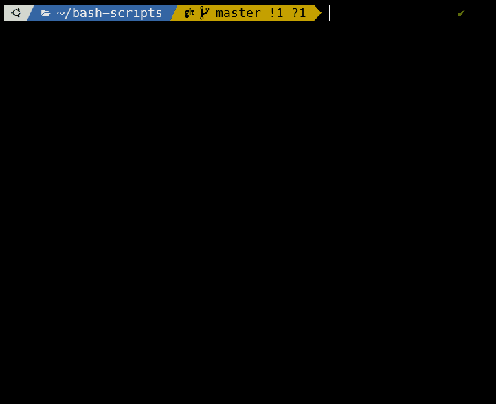

# Bash Scripts



```
 _______  _______  _______           _______  _______  _       
(  ____ )(  ____ )(  ___  )|\     /|(  ____ \(  ____ \( (    /|
| (    )|| (    )|| (   ) || )   ( || (    \/| (    \/|  \  ( |
| (____)|| (____)|| (___) || |   | || (__    | (__    |   \ | |
|  _____)|     __)|  ___  |( (   ) )|  __)   |  __)   | (\ \) |
| (      | (\ (   | (   ) | \ \_/ / | (      | (      | | \   |
| )      | ) \ \__| )   ( |  \   /  | (____/\| (____/\| )  \  |
|/       |/   \__/|/     \|   \_/   (_______/(_______/|/    )_)
```

